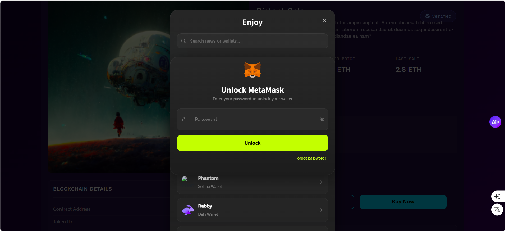
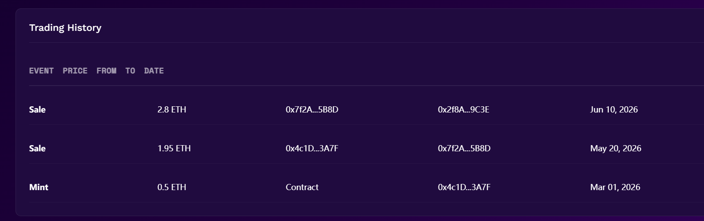

# SoftGalaxy · Some questions I have after trying the trading flow

---

**First — the password modal on the product page doesn't really belong here.**

In Product.jsx:568-649, after I pick MetaMask, a modal asks me to type a password to unlock the wallet. But browser wallets manage their own unlock — either I've already unlocked them in the browser, or the wallet itself will prompt me. So asking for a password inside SoftGalaxy feels odd. I think users will just wonder: "Wait — is this my MetaMask password, or my SoftGalaxy password?" Neither, actually — the code doesn't use this password to sign or log me in; it just closes the modal. And since the actual payment detail and signing happen inside the wallet later anyway

Suggestion: take out the "Unlock {wallet} + password input" layer. After I pick a wallet, call its connect method directly (the `connectWallet` function in Product.jsx:82-180 already does this). If the wallet isn't installed, show a friendly "Install MetaMask first and try again" card instead of a password box.


---

**Second — Transaction History should carry a txHash and a link to the block explorer.**

In Transactions.jsx:168-194, each row currently shows: ID, Date, Type, Item, Marketplace, Amount, Fee, Status. That's fine for an internal activity log, but the whole point of a Web3 history page is so I can independently verify "did this tx really happen?" So each row should include a `txHash` (truncated as `0x8a4C...7d2B`), ideally `network` and `blockNumber`, and a clickable external link to Etherscan (or the right explorer for that chain). Without it, if I want to confirm a 3.25 ETH purchase I have to leave SoftGalaxy, open my wallet, find the Activity tab, and manually hunt for it — which is a lot of friction and doesn't help build trust.

Even with mock data today, these fields should be in the schema so the page looks like a Web3 product.

---

**Third — there's no pagination on any list page.**

Transactions.jsx:179-194, the Top Movers list in Trading.jsx:128-141, and the single-NFT Trading History in Product.jsx:452-480 — all render everything via a plain `array.map()`.

It looks fine with 12 or 3 rows, but the moment this gets real usage (hundreds to thousands of rows), three things will happen: the page will render thousands of DOM nodes at once and tank performance, scrolling will become unbearably slow, and later when a backend is plugged in, pulling every tx in one call isn't a correct paginated API pattern anyway.

Suggestion:

- Transactions page: add pagination or a "Load more" button — 20 items per page, `← Prev · Page 1/N · Next →` at the bottom, or infinite scroll.
- Trading page's Top Movers: show the top 5 by default, with a "Show more" toggle to 20; or make it a scrollable list.
- Single-NFT Trading History on Product: show the most recent 5, and put a "View all →" link at the bottom that jumps to `/transactions?tokenId=xxx&collection=yyy`.
- Agree on a pagination shape for every list: `{ items: [...], total: N, page: 1, pageSize: 20 }`, so the frontend doesn't need a rewrite when the real backend lands.

---

**Fourth — the tx I create in the product page and the tx list in Transactions are completely disconnected.**

I clicked `Make Offer` in Product.jsx, typed an amount, submitted it — the flow looked fine. Then I went to `/transactions` to check it — my offer wasn't there.

In a working NFT marketplace, the flow should be: I initiate a tx on a product page → the tx is stored somewhere → I can see it on "My Transactions." Right now there's no state-management layer at all — no Redux, no Zustand, not even a basic React Context. So:

1. Txs created in Product.jsx have nowhere to persist.
2. Transactions.jsx can only render its own mock array.
3. On page refresh, everything is gone.

Suggested minimum fix, with zero new dependencies:

- Create `client/src/store/TransactionContext.jsx` using React Context + `useReducer`:
  - a `transactions` list with a unified schema (including `txHash`, `status`, `amount`, `item`, `type`...)
  - `addTransaction(tx)` — appends and persists to `localStorage`
  - `updateTransactionStatus(hash, status)` — updates one row by hash (Pending → Confirmed / Failed)
  - restores from `localStorage` on app start
- Wrap the app root with a `<TransactionProvider>` inside App.jsx (inside `<Router>` so all route pages can read it).
- In Product.jsx, call `addTransaction({ ..., status: 'PENDING' })` after `submitOffer()` and any real "Buy Now" signing flow.
- In Transactions.jsx, stop reading from the hard-coded array at the top of the file and pull the list from the new context.

With that one change, the flow closes: I click Buy Now → I immediately see a Pending row on Transactions → it updates to Confirmed once the chain confirms. This is the single biggest missing piece right now.

---

**Fifth — after "Buy Now / Make Offer" completes, there's no "where do I go next?"**

Walking through the offer flow in Product.jsx: modal opens → I type an amount → "Offer submitted successfully!" → modal auto-closes (Product.jsx:201-211). I land back on the product detail page with only a toast message and no obvious way to follow the transaction.

After a user completes any action that has on-chain state, the natural next question is "Did this actually go through, and will it succeed or fail?" The current UI doesn't give them a path — it drops them back where they were.

Suggestion: in the success modal (same pattern for offer and buy flows), add a secondary button next to Close:

```
Offer submitted successfully!
txHash: 0x8a4C...7d2B  ↗

        [ Close ]   [ Go to my transactions → ]
```

"Go to my transactions" uses `react-router-dom`'s `navigate('/transactions')`. If the `TransactionStore` from the fourth point exists already, the user will see their new Pending row right away — the experience feels continuous.

---

**Quick summary of priority**

| Priority | What | One-line benefit | Files |
|----------|------|-----------------|-------|
| P0 | Remove the "Unlock password" modal | Eliminates the biggest source of user confusion | `client/src/pages/product/Product.jsx` |
| P0 | Add a shared `TransactionStore` | Closes the Product ↔ Transactions product loop | New file `client/src/store/TransactionContext.jsx`, plus Product.jsx / Transactions.jsx / App.jsx |
| P1 | Add `txHash` + explorer link to Transactions | Turns the history page into a Web3-verifiable page | `client/src/pages/transactions/Transactions.jsx` |
| P1 | Add a "go to my txs" button on the success modal | Gives the user a clear "what's next" path | `client/src/pages/product/Product.jsx` |
| P2 | Pagination / Load more on list pages | Prevents a predictable performance collapse at scale | Transactions.jsx, Trading.jsx, Product.jsx |

---